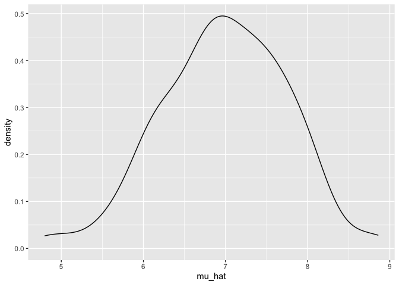
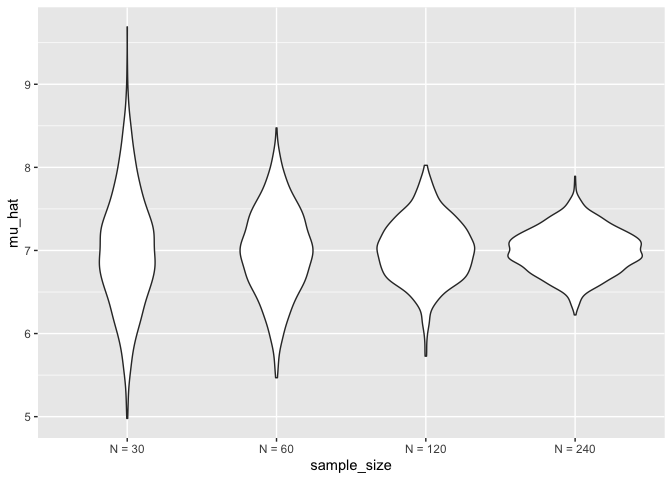
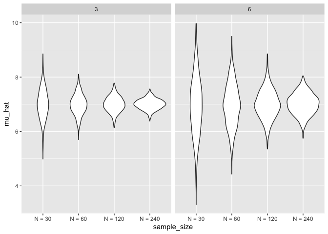

Simulations
================
2022-11-03

## Simulations!!

Here’s our function from before.

``` r
sim_mean_sd = function(n_obs, mu = 7, sigma = 4) {
  
  x = rnorm(n = n_obs, mean = mu, sd = sigma)

tibble(
  mu_hat = mean(x), 
  sigma_hat = sd(x)
)
}
```

How did we use this before?

``` r
sim_mean_sd(n_obs = 30)
```

    ## # A tibble: 1 × 2
    ##   mu_hat sigma_hat
    ##    <dbl>     <dbl>
    ## 1   7.33      3.70

Every time we run this function, we get different estimates. Can we do
this 100 times? 1000 times?

How can we use this now…a for loop perhaps? We can create a vector with
100 empty spots, and fill these columns with `sim_mean_sd`.

``` r
output = vector("list", length = 100)

for (i in 1:100) {
  output[[i]] = sim_mean_sd(n_obs = 30)
  
}

bind_rows(output)
```

    ## # A tibble: 100 × 2
    ##    mu_hat sigma_hat
    ##     <dbl>     <dbl>
    ##  1   7.53      3.18
    ##  2   7.44      3.84
    ##  3   7.45      3.53
    ##  4   5.68      3.69
    ##  5   7.95      4.22
    ##  6   7.27      4.34
    ##  7   6.05      4.05
    ##  8   7.10      3.72
    ##  9   7.55      4.11
    ## 10   7.87      3.79
    ## # … with 90 more rows

Let’s use list columns instead! `expand_grid` gives us all possible
combinations of sample size = 30 and iteration from 1 to 100. Then, we
use `map` to input the results of `sim_mean_sd` into our df.

``` r
sim_results_df = 
  expand_grid(
    sample_size = 30,
    iteration = 1:100
  ) %>% 
  mutate(
    estimate_df = map(sample_size, sim_mean_sd)
  ) %>% 
  unnest(estimate_df)

sim_results_df
```

    ## # A tibble: 100 × 4
    ##    sample_size iteration mu_hat sigma_hat
    ##          <dbl>     <int>  <dbl>     <dbl>
    ##  1          30         1   7.63      4.15
    ##  2          30         2   8.86      4.29
    ##  3          30         3   7.32      3.96
    ##  4          30         4   7.82      4.97
    ##  5          30         5   6.16      4.08
    ##  6          30         6   8.67      3.55
    ##  7          30         7   7.08      4.12
    ##  8          30         8   7.36      3.99
    ##  9          30         9   7.62      4.76
    ## 10          30        10   7.13      4.35
    ## # … with 90 more rows

Let’s plot some summaries for our simulation results.

``` r
sim_results_df %>% 
  ggplot(aes(x = mu_hat)) + 
  geom_density()
```

<!-- -->

What if we changed the sample sizes, and simulated 1000 times?

``` r
sim_results_df = expand_grid(
    sample_size = c(30, 60, 120, 240), 
    iteration = 1:1000
  ) %>% 
    mutate(
      estimate_df = map(sample_size, sim_mean_sd)
    ) %>% 
    unnest(estimate_df)
```

``` r
sim_results_df %>% 
  mutate(sample_size = str_c("N = ", sample_size), 
         sample_size = fct_inorder(sample_size)) %>% 
  ggplot(aes(x = sample_size, y = mu_hat)) +
  geom_violin()
```

<!-- -->

As we expect, our distribution is much wider with a larger sample size
and more spread out with a narrower sample size

``` r
sim_results_df %>% 
  mutate(sample_size = str_c("N = ", sample_size), 
         sample_size = fct_inorder(sample_size)) %>% 
  group_by(sample_size) %>% 
  summarise(emp_st_err = sd(mu_hat))
```

    ## # A tibble: 4 × 2
    ##   sample_size emp_st_err
    ##   <fct>            <dbl>
    ## 1 N = 30           0.698
    ## 2 N = 60           0.524
    ## 3 N = 120          0.374
    ## 4 N = 240          0.265

``` r
4 / sqrt(120) # This is close to what we got in our df
```

    ## [1] 0.3651484

## Let’s see two inputs…

Let’s try varying two simulation parameters

``` r
sim_results_df = expand_grid(
  sample_size = c(30, 60, 120, 240), 
  true_sigma = c(6, 3),
  iteration = 1:1000
  ) %>% 
  mutate(
     estimate_df = map2(.x = sample_size, .y = true_sigma, ~sim_mean_sd(n_obs = .x, sigma = .y))
  ) %>% 
  unnest(estimate_df)
```

``` r
sim_results_df %>% 
  mutate(sample_size = str_c("N = ", sample_size), 
         sample_size = fct_inorder(sample_size)) %>% 
  ggplot(aes(x = sample_size, y = mu_hat)) + 
  geom_violin() + 
  facet_grid(. ~ true_sigma)
```

<!-- -->

Note knitting simulations may take time. `cache = TRUE` saves results
when you first run it and doesn’t re-run it each time you knit. It
doesn’t run again unless you change the code chunk. Note this may be an
issue when your code relies on previous changes.
